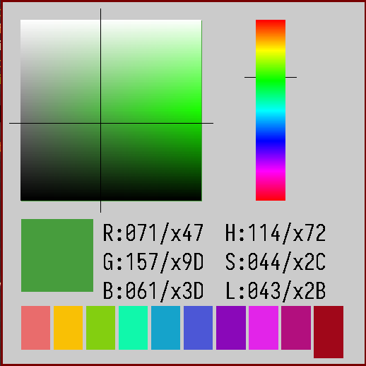

# Randy's Nose Picker
A quick and easy color picker for visualizing RGB/HSL

## Use
Adjust saturation in the big square with `H/L`, luminence with `J/K`. Or sat with `J/K` and luminence with `H/L`. I forgot which but now that I think about it, it could go in the config file.
The hue spectrum slider adjusts with `N/B`.
Holding either `shift` increases the adjust speed of any other input.
If it wasn't already obvious, the bottom portion displays the active color in a big square along with RGB and HSL value, in decimal and hex.
Mouse support -- click/drag around in the hue spectrum and L/S square to change values.
New -- Palette system. Recall a saved color from the bottom row (1-10, L->R), or overwrite the active palette selection with `return`.

## Configure and build
### Dependencies
The only real dependencies are SDL2 and SDL2_TTF (for text). I sure hope you have libm.

### Configure
Configuration of UI things is done through source/config.h. Most options will be self-explanatory.
The only thing you'll *really* need to touch is font_path -- you probably don't have iosevka installed. Find a font you like and use it. It looks cool with the Pentiment fonts lol. I'll figure out font lookup later.
The worst part here is the UI system I cooked up. UI components in the config_layout struct are tabbed to be a bit more clear but their dimensions are adjustable relative to the tab-parent above them, so you can rearrange the UI easily enough to your liking. Adjusting master window sizing might require this.

### Build
Just `make`, it should go for the base `picker` rule. `picker_debug` is self-explanatory, and `install` will build and chuck into (probably) your path. Likely you'll need sudo for it.

## Why?
I got annoyed with googling for online color pickers every time I wanted a quick color reference so I cranked this out mostly on a saturday while buzzed. The UI component was the more fun part that I'd like to develop a bit more. But it's enough.
